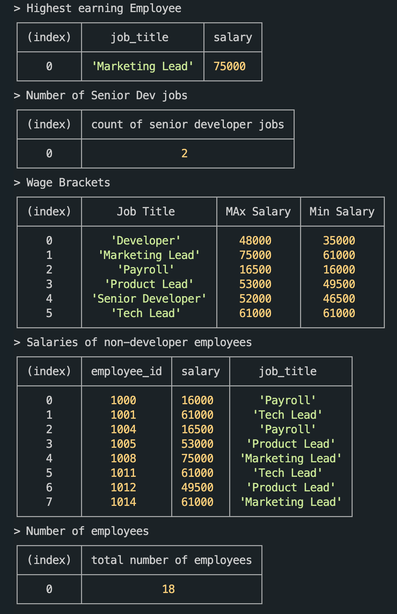

# SQL Extention

## Task

For the provided Employees database, answer the following questions:

1. What is the total number of employees?

2. Who is the highest earning employee and what is their job title?

3. How many Senior Developers are there?

4. What are the wage brackets for the different jobs?

5. Who are the employees who are not developers, and what are their salaries?

## Solution

